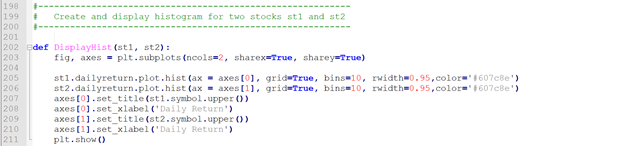

<h2> <b>Analyzing Risk and Calculating VaR using Python for Single or Multi-Asset Portfolios</b> </h2>

<h3> <i>Introduction</i> </h3>

Balancing a portfolio is one of the most important points while managing portfolio risk. Asset allocation (no part of a portfolio is correlated with another) along with diversification and rebalancing can help alleviate any unnecessary risk within a portfolio. 

There are 5 risk metrics: **Alpha, Beta, R Squared, Standard Deviation, and the Sharpe Ratio**.

**Alpha** tells whether a stock is out-performing or under-performing the market or a set benchmark index. Alpha greater than 1 signals outperformance, while alpha less than 1 signals under-performance in relation to the market or a selected benchmark index.

**Beta** is associated with volatility. It measures systemic risk of a stock in comparison to the market or a selected benchmark index. Beta equal to 1 implies that a stock moves very similarly to the way the market or a selected benchmark does. Beta over 1 means that a stock is more volatile than a benchmark. Beta less than 1 shows that the stock is less volatile compared to the benchmark.

**R-Squared** measures the correlation percentage between the movements of a stock and the market or a benchmark index. An R-Squared value of 90% would show high correlation in the movement between the two. R-Squared of 50% could be considered to be a low correlation, and an R-Squared of under 50% would mean very little correlation in the movements between the selected stock and benchmark.

**Standard Deviation** shows how much a return on investment differs from an expected return or an average return. A smaller standard deviation shows a less volatile investment. This means that returns are not very dispersed equating to lower risk. The larger the standard deviation, the more risky an ivestment is. A larger standard deviation means that returns are distributed farther from the mean.

Lastly, the **Sharpe Ratio** compares the possible performance risk of a potential investment compared to a determined risk-free asset. The higher the Sharpe Ratio the better. 

In my code below, risk is calculated using **Value at Risk (VaR)**. VaR computes the maximum loss based on a degree of confidence that could occur within a portfolio when investing. If there is a degree of confidence of 95% that would say that there is a 95% chance of not losing more than the outputted VaR value.

When managing risk, it is also important to understand, visually, its distribution. **Normal Curve Distribution** plots all values around the probability's mean. The two most important aspects of distributions in relation to risk are mean and standard deviation. Mean can be used to help calculate the average increase or decrease that a stock is undergoing on a daily basis. Standard deviation shows how much other values differ from the mean. The smaller the standard deviation the better. This is because as standard deviation grows, it shows that an investment is more risky.

**Kurtosis** is important when working with distributions as well. Kurtosis measures the extreme values within each fat-tail. A distribution with high kurtosis signifies to investors that returns sometimes will be much more extreme compared to the mean (Kurtosis Risk). High kurtosis can be identified as a distribution curve with a low, even distribution and fat-tails. A low kurtosis distribution shows lower possibility of having extreme returns and is identified as an even distribution situated closely around the mean with skinny-tails. Kurtosis has no correlation to the way a distribution curve looks like. A distribution curve could have a round, semi-circle, arched top and still have a high kurtosis. Kurtosis solely depends on instances where a distribution shows fat-tails and signs of risk within the size of each standard deviation.

<h3> <i>Goals</i> </h3>

The goal of this project is to create a python library that will ease risk analysis from stock securities. Microsoft (MSFT) and S&P 500 (SPY) data are used to illustrate the functionality of the code. By understanding the information presenting in the introduction, one can determine whether it is investing in a certain stock.

<h3> <i>Understanding the Code</i> </h3>

1.	The first step within any code is to load all dependencies. Dependencies are packages created within Python, which have certain functions built in that are not included in Python’s original package.
Here I loaded all the dependencies I used to do the calculations and be able to run certain functions within the code.

The following explains what each one does and how they are used:

•	**SciPy.stats (norm)** – This project requires to run the Normal Continuous Random Variable (norm) object, which is imported from the scipy.stats package. Functions, for example, kurtosis(), skew(), and zscore() are available within this package. Scipy.stats works hand-in-hand with NumPy arrays in order to produce functions within the scipy.stats package.  

Reference for more info:
(https://www.tutorialspoint.com/scipy/scipy_stats.htm)

•	**NumPy** – NumPy is a scientific computing package, which usually works with arrays to calculate data. Within the project NumPy is specifically used to create arrays of Microsoft (MSFT) and S&P 500 (SPY) data to compute the regressions between their daily returns using ‘Adjusted Close Prices’.

Reference for more info: 
(https://docs.scipy.org/doc/numpy-1.13.0/user/whatisnumpy.html)

•	**Pandas** – Pandas is used for data manipulation and analysis usually within data in forms of data frames. Within my code, Pandas is defined as “pd” and is used in order to help read the files I am uploading into my code.

Reference for more info:
(https://pandas.pydata.org/pandas-docs/stable/) 

•	**Matplotlib.Pyplot** – Matplotlib is a plotting library producing graphs and interactive environments within Python. The code uses Pyplot, which is used for basic, simple graphs.

Reference for more info:
(https://matplotlib.org/)

•	**Statsmodels.api** - Calculates statistical data tables within Python. It is an addition to libraries such as NumPy, SciPy, and Pandas.

Reference for more info:
(https://www.statsmodels.org/stable/index.html)

2.	I choose to load the datasets of MSFT and SPY using the class method. I found this an easier method then having to create individual functions, recalling the data over and over again. This way you are able to call back the class easily and calculate values more efficiently. 

The syntax for classes is generally the same. 
- Your first step is line 90. Line 90 writes “class stock:” where you are naming the class “stock”.
- The next step is to initialize (“__init__”) the class, which is done in line 97. You’ll see in line 97 that there are two variables: self and symbol. Self is the symbol used throughout the code to recall back to the class created. The symbol variable is identified only within the class. It helps organize the class and show what is being done.
- Past line 97, the code is reading each provided file. Line 98 defines the path to where the two files are located. The path should look something like: C:\Users\name\Desktop\Final. Line 99 uppercases all stock symbols inputted. For example, line 100 is self.symbol = ‘msft’, line 99 changes ‘msft’ to ‘MSFT’.
- Line 100 through line 105 import the MSFT and SPY data. I wrote this code specifically for importing those two tickers. That is why the code does not account for other stock tickers. You may follow the exact syntax as in the code, though you will only have to write in the path of the data.

3. Now it is time to do the calculations. Here you can see that I use "self" to recall back the data I loaded in my class, followed by the name of the function being done.
- I choose to not include daily returns in my class in order to present the calculation more clearly. I calculated MSFT and SPY daily returns by using the percentage change in the adjusted close price. You use the adjusted close price instead of the close price because close price only includes the price at which the stock costed at the close of a trading day. While, the adjusted close uses closing price as a base value, yet accounts for dividends, stock splits, and new stock offerings in order to come up with an adjusted close price.
- The following code, from line 110 to line 153 calculates daily returns (based on percentage change in adjusted close price, mean, standard deviation, Sharpe ratio, kurtosis, skewness, variance, and value at risk (VaR95) at 95% confidence).

4. Line 158 to line 184 is simply running the functions done in step 3 and formatting the answers to print in a clear way.

5. Another factor to this code is displaying the data’s linear regression.
- Within my code, st1 is MSFT and st2 is SPY.
- While displaying a linear regression, you must import two packages: NumPy and statsmodels.api. X and Y are two variables using NumPy to create arrays of the daily returns of MSFT and SPY.
- Lines 194 to 196 describe the formatting of the linear regression that is to be printed.

6.	The last part to the code is displaying histograms for each stock’s distribution. 
- The matplotlib.pyplot library is used here as plt.
- Line 203 creates two variables, fig (figure) and axes with plt.subplots. Here the number of columns (ncols) and if both plots share an x-axis (sharex) and a y-axis (sharey).
- Same as within the regression, st1 is MSFT and st2 is SPY. In lines 205 and 204, the code is plotting MSFT and SPY data using their dailyreturns function calculated in line 110. Here we also identify certain aspects of the graph we are trying to plot. We identify where we want the axes to be places ([0] being left-hand side, [1] being bottom), if we want a grid or not, how many columns to show data (bins), width between each bin of data (rwidth), and color of the data within the graph in rgb. 
- Lines 207 to 210, create names for the axes. Followed by plt.show() which runs the code for plotting the histogram of the dailyreturns of MSFT and SPY.

